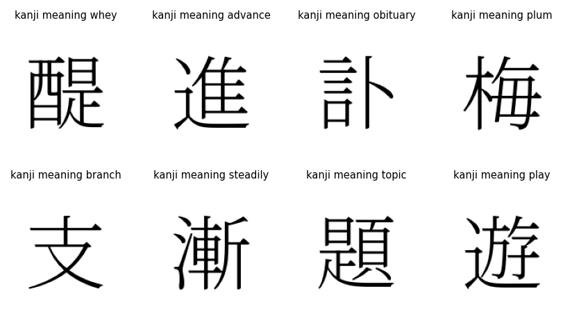

# Kanji PNG Dataset



Generate PNG images and metadata for Japanese kanji from the KANJIDIC2 dataset using a Japanese font.

## Requirements

- Python 3.7+
- Pillow
- matplotlib
- KANJIDIC2 XML (https://www.edrdg.org/kanjidic/kanjidic2.xml.gz)
- Noto Serif JP font (https://fonts.google.com/noto/specimen/Noto+Serif+JP)

## Setup

1. Download `kanjidic2.xml` and place it in the project directory.
2. Download the Noto Serif JP font and place it at `Noto_Serif_JP/NotoSerifJP-VariableFont_wght.ttf`.
3. Install dependencies:
   ```sh
   pip install -r requirements.txt
   ```

## Usage

- Run `main.py` to generate PNG images and metadata for all kanji in the dataset (not limited to those with frequency info).
- Run `sample.py` to create a 2x4 grid of random kanji (with frequency info) and their meanings, saved as `sample.png`.

## Notes

- The main dataset includes all kanji in KANJIDIC2, regardless of frequency.
- You can adjust image size and font in the config section of the scripts.
- The sample output is for quick visualization only.
