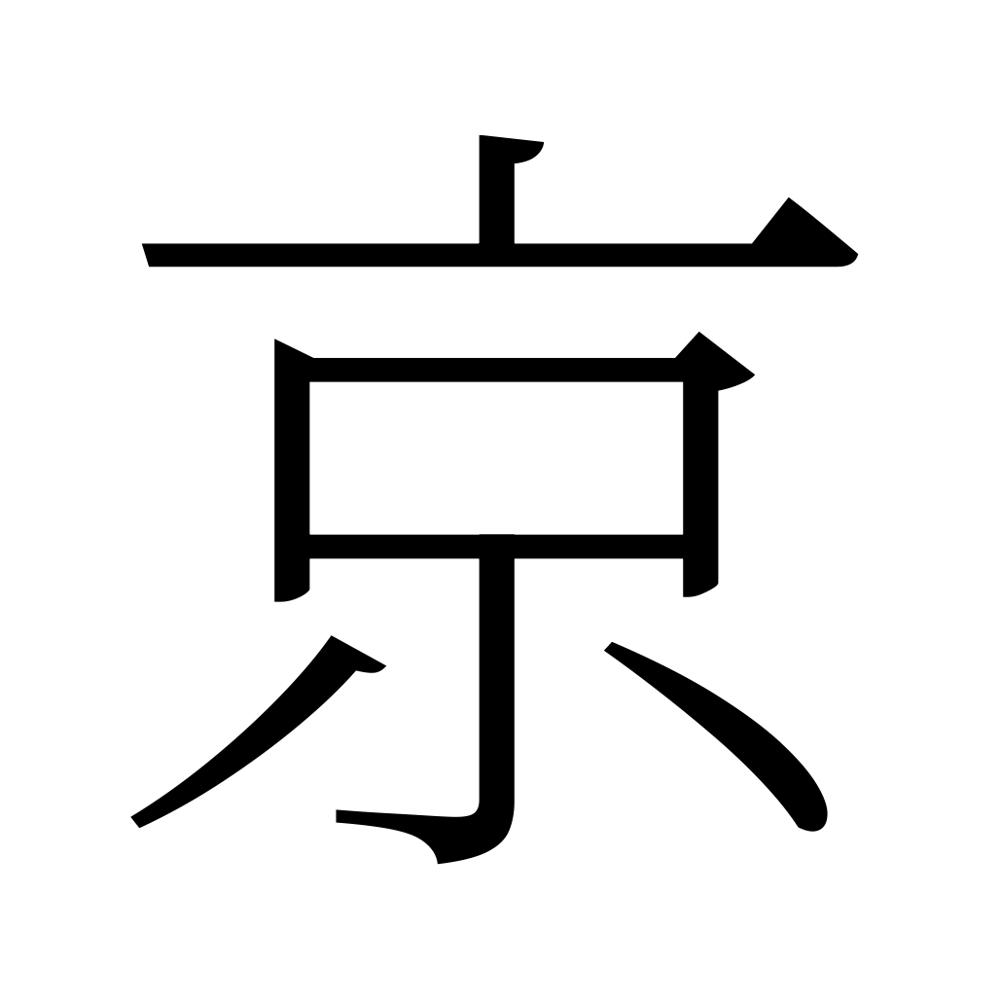
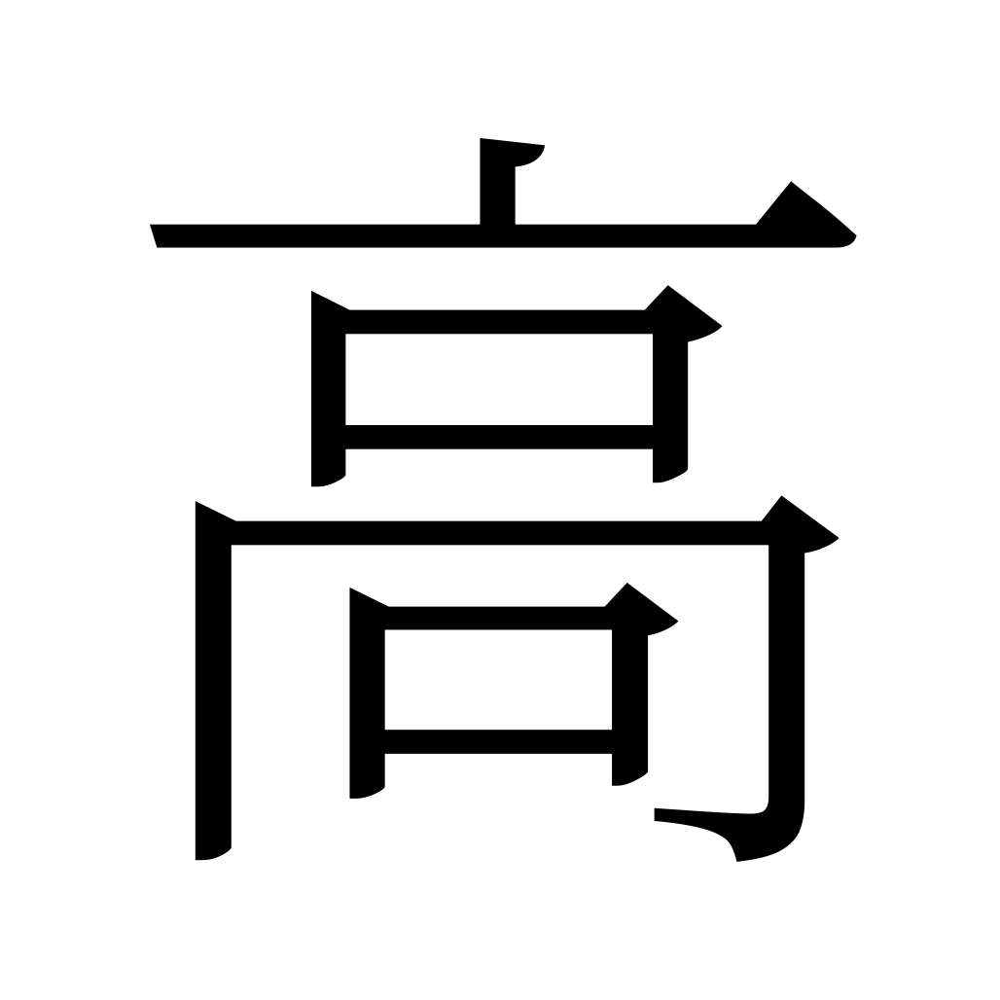
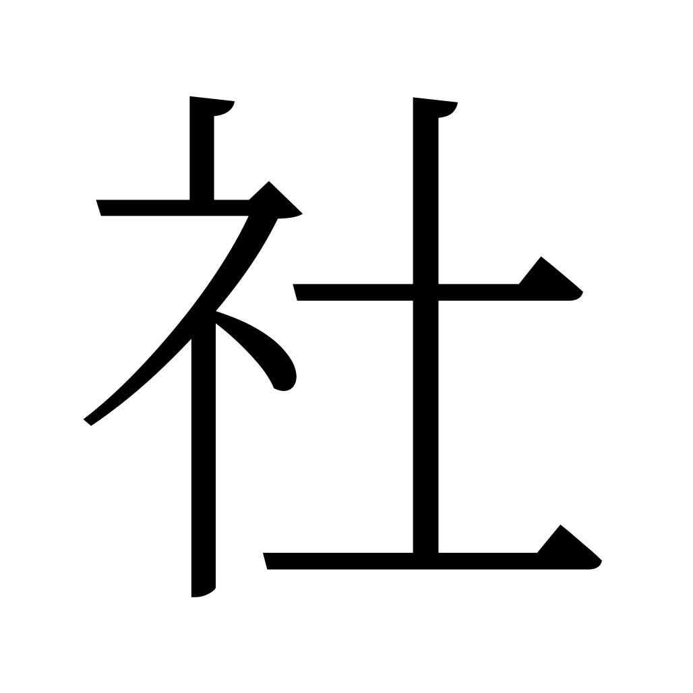
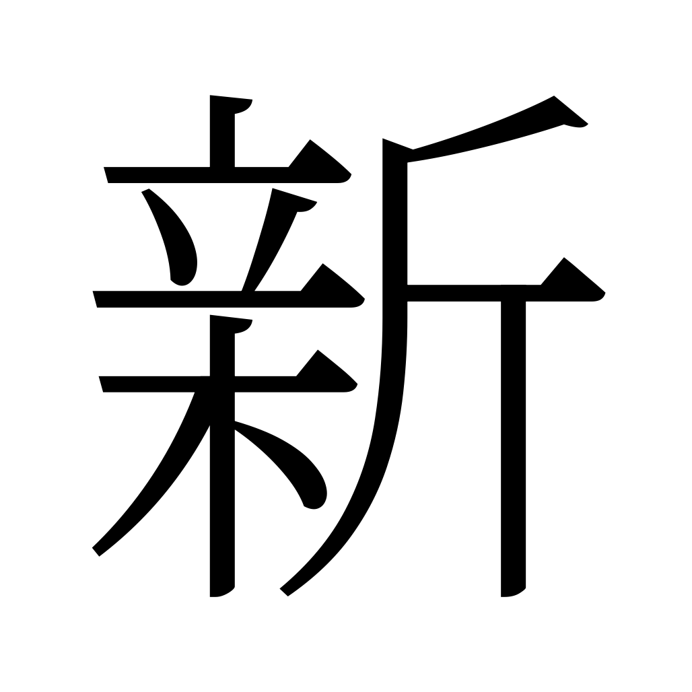
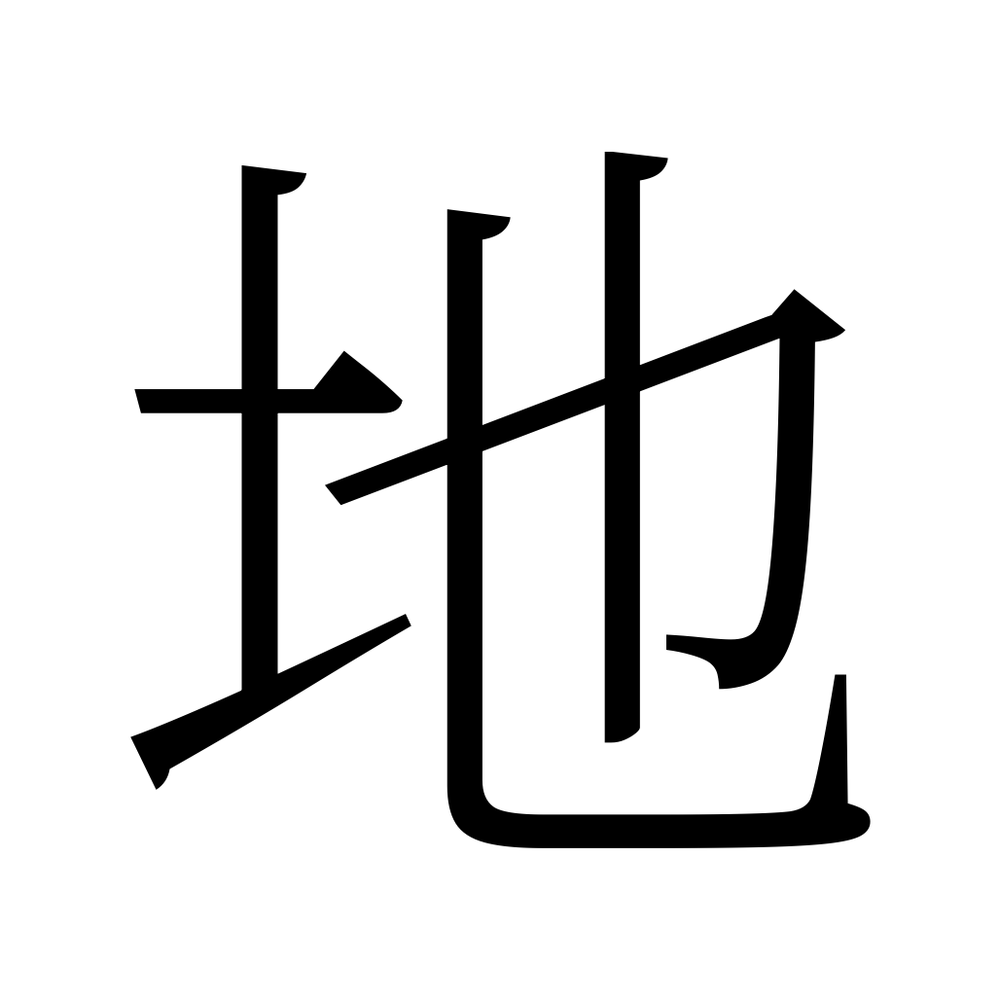
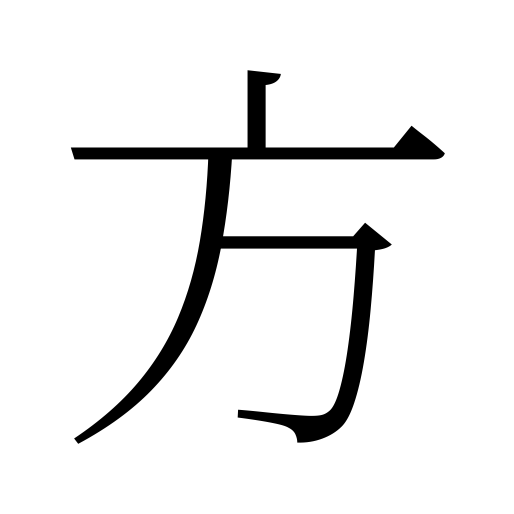
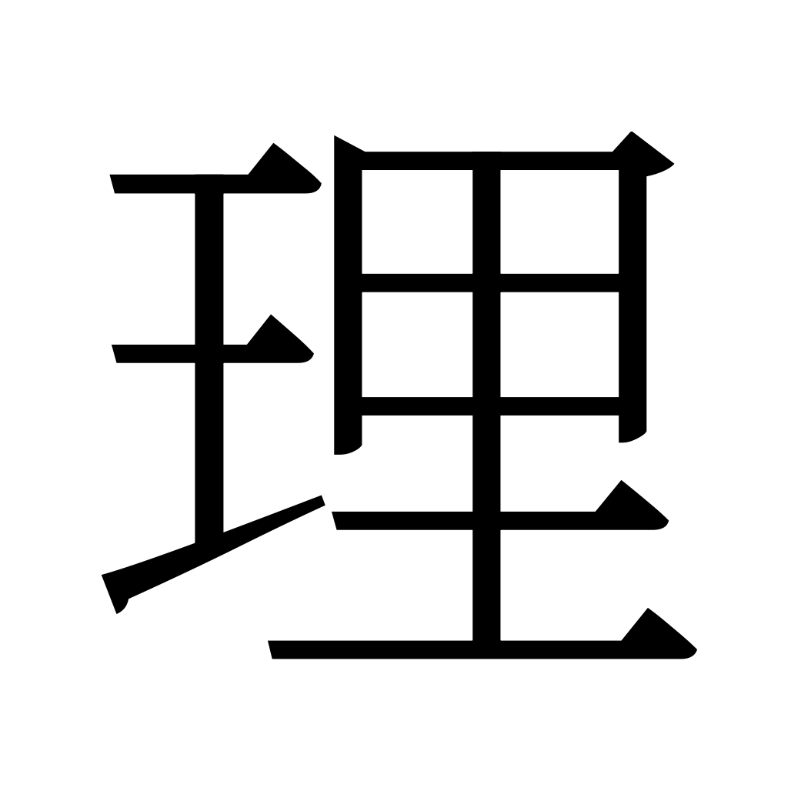

# Kanji PNG Dataset

|  |  |  |  |
| -------------------- | -------------------- | -------------------- | -------------------- |
|  |  |  |  |
|  |  |  |  |

This project generates PNG images and metadata for all 13,108 Japanese kanji characters in the KANJIDIC2 dataset using a Japanese font.

## Requirements

- Python 3.7+
- Pillow (see `requirements.txt`)
- KANJIDIC2 XML file (download from https://www.edrdg.org/kanjidic/kanjidic2.xml.gz)
- Noto Serif JP font (download from https://fonts.google.com/noto/specimen/Noto+Serif+JP)

## Setup

1. Download and extract the KANJIDIC2 XML file to the project directory as `kanjidic2.xml`.
2. Download and extract the Noto Serif JP font to the project directory as `Noto_Serif_JP/NotoSerifJP-VariableFont_wght.ttf`.
3. Install dependencies:
   ```sh
   pip install -r requirements.txt
   ```
4. Run the notebook `main.ipynb`.

## Output

- A folder `kanji_dataset` will be created containing:
  - `images/` directory with PNG images of all kanji (one per file, 128x128 px by default)
  - `metadata.json` with kanji, meanings, stroke count, frequency, and JLPT level
- The folder will be zipped as `kanji_dataset.zip` and the original folder will be removed.

## Notes

- All kanji in the KANJIDIC2 dataset are included (Processed 13,108 kanji).
- You can adjust image size and font in the notebook config section.

## Example metadata (excerpt from metadata.json)

```json
[
  {
    "file": "images/0000.png",
    "kanji": "意",
    "meanings": ["idea", "mind", "heart", "taste", "thought", "desire", "care", "liking"],
    "stroke_count": 13,
    "frequency": 99,
    "jlpt": 3
  },
  {
    "file": "images/0001.png",
    "kanji": "一",
    "meanings": ["one", "one radical (no.1)"],
    "stroke_count": 1,
    "frequency": 2,
    "jlpt": 4
  },
  {
    "file": "images/0002.png",
    "kanji": "員",
    "meanings": ["employee", "member", "number", "the one in charge"],
    "stroke_count": 10,
    "frequency": 54,
    "jlpt": 3
  },
  {
    "file": "images/0003.png",
    "kanji": "円",
    "meanings": ["circle", "yen", "round"],
    "stroke_count": 4,
    "frequency": 69,
    "jlpt": 3
  }
]
```
